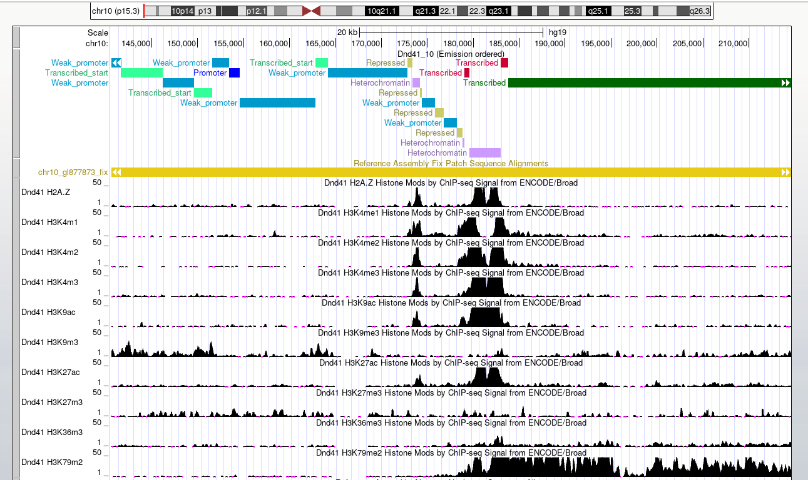

# hse_hw3_chromhmm
Ссылка на colab: https://colab.research.google.com/drive/1Q8bsFj_FGDIagr4SZVAO-wjvG8AiqKVt?usp=sharing
## Метки
| Метка | Файл |
|-------|--------|
| H2AFZ	| wgEncodeBroadHistoneDnd41H2azAlnRep1.bam |
| H3K27ac	| wgEncodeBroadHistoneDnd41H3k27acAlnRep1.bam |
| H3K27me3	| wgEncodeBroadHistoneDnd41H3k27me3AlnRep1.bam |
| H3K36me3	| wgEncodeBroadHistoneDnd41H3k36me3AlnRep1.bam |
| H3K4me1	| wgEncodeBroadHistoneDnd41H3k04me1AlnRep1.bam |
| H3K4me2	| wgEncodeBroadHistoneDnd41H3k04me2AlnRep1.bam |
| H3k4me3	| wgEncodeBroadHistoneDnd41H3k04me3AlnRep1.bam |
| H3K79me2	| wgEncodeBroadHistoneDnd41H3k79me2AlnRep1.bam |
| H3K9ac	| wgEncodeBroadHistoneDnd41H3k09acAlnRep1.bam |
| H3K9me3	| wgEncodeBroadHistoneDnd41H3k09me3AlnRep1.bam |
| Контрольный	| wgEncodeBroadHistoneDnd41ControlStdAlnRep1.bam |

## ChromHMM

## UCSC GenomeBrowser

| Состояние | Название |
| ---- | ---- |
| 1 | Promoter (Активный промотер) |
| 2 | Weak promoter (Слабый промотер) |
| 3 | Transcribed start (Начало транскрибирующегося генома) |
| 4 | Intron (Интрон в активном гене) |
| 5 | Transcribed (Активный ген) |
| 6 | Transcribed (Активный ген) |
| 7 | Transcribed end (Конец активного генома) |
| 8 | Repressed (Репрессированные хроматин) |
| 9 | Heterochromatin (Межгенное пространство) |
| 10 | Heterochromatin (Репрессированный хроматин, межгенное пространство) |

## Бонус

